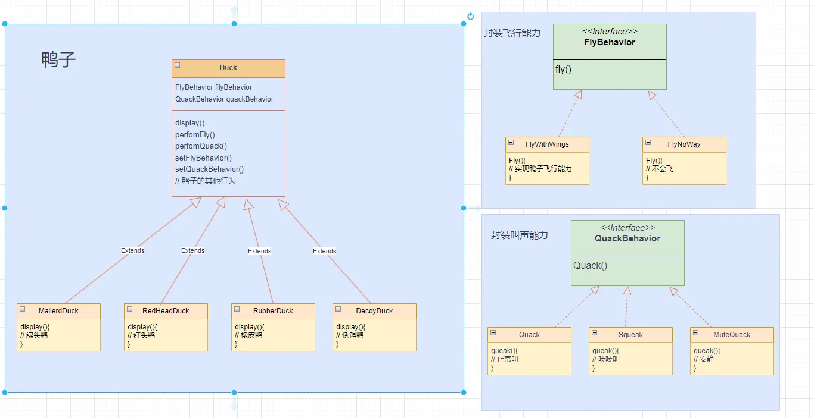

# 《Head First 设计模式》和实例
> **设计模式**是在某种情景下，针对某问题的某种解决方案

- **随时想到系统以后可能需要的变化以及应付变化的原则**
- **所有的原则都应该在有帮助的时候才遵守**
- **所有的设计都不免需要折中**
- 良好的OO设计必须具备可复用、可扩充、可维护三个特性
- 代码应该如同晚霞中的莲花一样地关闭（免于改变），如同晨曦中的莲花一样地开放（能够扩展）

## 1. 设计原则
1. 找出应用中**可能需要变化之处**，把它们**独立出来**，**不要和那些不需要变化的代码混在一起**
2. **面向接口编程**，而不是面向实现编程

> 接口是Java中的`interface`，当然这里强调的不是它，面向接口编程强调的是**多态**。
3. 多用组合，少用继承
4. 为**松耦合**的实现努力，减少系统组件之间的依赖
5. **开放-关闭原则**: 类应该对扩展开放，对修改关闭
6. **依赖倒置原则**: 依赖抽象，不要依赖具体实现类
> 依赖倒置原则变量不持有具体实现类的引用，可以改用工厂模式来代替。
> 这就类似在Spring中注入的bean是具体实现，但是它们的引用却是接口，这样声明的字段不用管注入的是谁，
> 直接调用方法即可，而且可以在运行时改变实现类型，"切换不同的策略"。
7. 最少知识原则：一个类对于其他类知道的越少越好，类只和它的密友谈话
8. 避免循环依赖
9. **单一职责(SRP)**: 尽可能让每个类保持单一的责任，当一个模块或一个类被设计成只支持一组相关的功能时，
我们称它为高内聚，反之，当被设计成支持一组不相关的功能时，
我们称它为低内聚（内聚用来衡量一个类或模块紧密地达到单一职责）
## 2. 策略模式
> **策略模式**：定义了一系列算法或策略，并将每个算法封装在独立的类中，使得它们可以互相替换。

我对策略模式的理解：
1. 解耦与职责分离
- 没有策略模式的设计中，通常会把多种行为写在同一个类里，用一堆 if-else 或者 switch 来决定执行哪段逻辑。这样代码臃肿、可读性差，也不利于维护。  
- 采用策略模式后，把每一种行为都做成一个独立的策略类，实现同一个接口。上下文（Context）只负责持有一个接口引用、并在适当的时候调用它。

```java
public abstract class Duck {
    // 上下文（Context）只负责持有一个接口引用、并在适当的时候调用它
    protected FlyBahavior flyBahavior;
    protected QuackBehavior quackBehavior;

    public Duck(){

    }

    /**
     * 鸭子飞行能力委托给行为接口
     */
    public void performFly(){
        flyBahavior.fly();
    }

    // 委托给行为接口
    public void performQuack() {
        quackBehavior.quack();
    }
// ...... 

}
```
2.  动态可替换与运行时灵活性
- 过向上下文注入不同的策略实例，或者在运行中调用 setStrategy()，就能立刻改变程序的行为，而不用改动或重编译现有类。
- 这对需求常变、或者在不同场景下要使用不同算法的系统来说，提供了极大的灵活性。例如，同一个支付模块里，可以在支付宝、微信、银行卡之间动态切换支付策略。
3. 符合开闭原则
- 单个策略类职责单一、代码量小，非常适合单元测试
- 同样的策略也可以在不同的上下文中复用，比如在一个图像处理项目里，对同一张图片做不同滤镜，只要把滤镜算法抽成策略，就能在多个处理流程里共享。


  策略模式代码示例在 chapter1 包下，先看下面的 uml 类图好理解，将鸭子的能力拆分并封装，
组合到Duck类中，实现高内聚低耦合，灵活扩展鸭子的能力。
另外在 Duck 类中有 setFlyBehavior() 和 setQuackBehavior 支持动态改变鸭子的行为。

